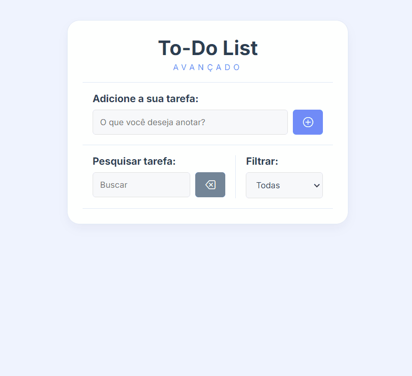

# 📝 To Do List Avançado

 

    <h2>🎯 Sobre o Projeto</h2>
    Este é o quinto projeto em JavaScript, focado no desenvolvimento de uma lista de tarefas para organizar atividades. O objetivo foi explorar JavaScript puro na implementação dessas funcionalidades.

 

## 👨🏾‍💻 Desafio do Projeto
 

O desafio consistiu em desenvolver um aplicativo de <strong>gerenciamento de tarefas</strong> utilizando <strong>JavaScript puro</strong>, com as seguintes funcionalidades:

<ul>
  <li><strong>Adicionar, editar e deletar tarefas</strong>.</li>
  <li><strong>Marcar tarefas como concluídas</strong>.</li>
  <li><strong>Filtrar tarefas</strong> por pendentes, concluídas ou todas.</li>
  <li><strong>Persistência no Local Storage</strong>, mantendo as tarefas salvas mesmo após recarregar a página.</li>
</ul>

## 📸 Screenshots

    

 

## 🏆 Aprendizados 

- Seleção de elementos HTML.
- Remoção de elementos do DOM.
- Filtragem de elementos no DOM.
- Aplicação de ícones via CDN.
- Adição de eventos.
- Manipulação de classes CSS com JavaScript.
- Interação com botões e formulários.
- Uso do Local Storage.

 

## 🚀 Tecnologias Utilizadas

- JavaScript
- HTML5
- CSS3

 

## 🔗 Projeto On-line
Este projeto está disponível para visualização on-line.  
Você pode acessá-lo através do link: https://todo-list-advanced-henna.vercel.app/

 

##

    Este projeto foi desenvolvido como parte do curso <strong>Formação Front-end - HTML, CSS, JavaScript, React e +</strong>, ministrado por <strong>Matheus Battisti</strong> da Escola de Programação <strong>🕒 Hora de Codar</strong>.

